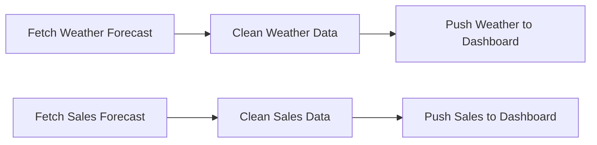
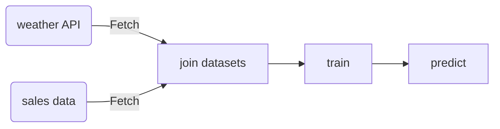
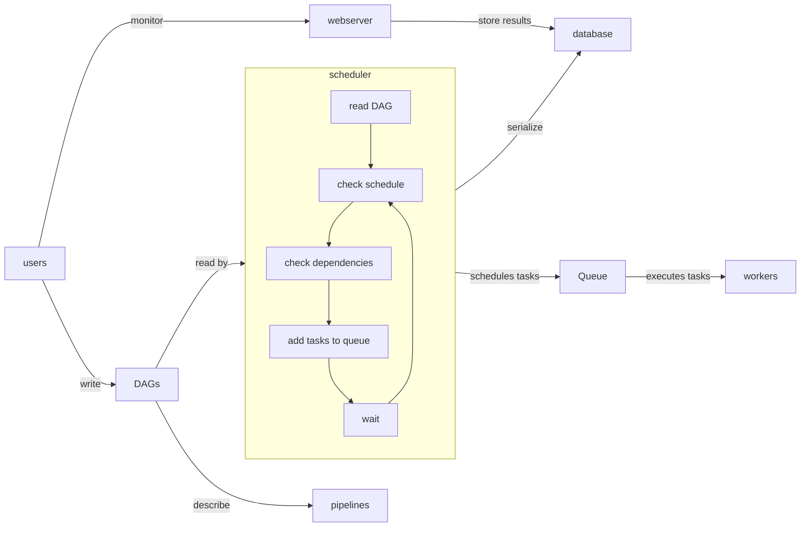

# Chapter 1

Code accompanying Chapter 1 of the book 'Data pipelines with Apache Airflow'.

## Contents

This code example contains the following DAGs:

- 01_umbrella_predictions.py - DAG illustrating the Umbrella use case.

## Usage

To get started with the code examples, start Airflow in docker using the following command:

    docker-compose up -d

Wait for a few seconds and 
you should be able to access the examples at http://localhost:8080

To stop running the examples, run the following command:

    docker-compose down

Data pipelines can be represented as DAGs, 
which clearly define tasks and their dependencies. 

These graphs can be executed efficiently, 
taking advantage of any parallelism inherent in the dependency structure.

Although many workflow managers have been developed over the years for executing graphs of tasks, 
Airflow has several key features that makes it uniquely suited for implementing efficient, 
batch-oriented data pipelines.

Airflow consists of three core components: 
* the webserver 
* the scheduler 
* the worker  

They work together to schedule tasks from your data
pipelines and help you monitor their results.