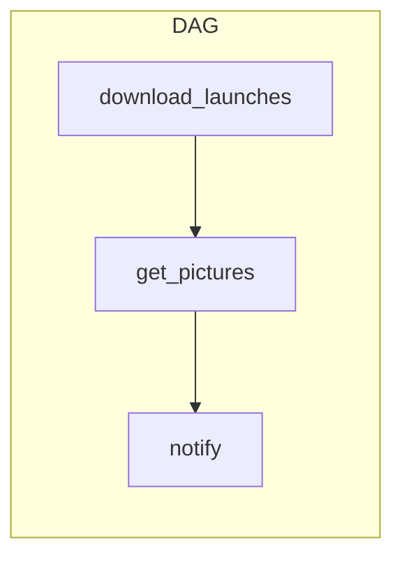
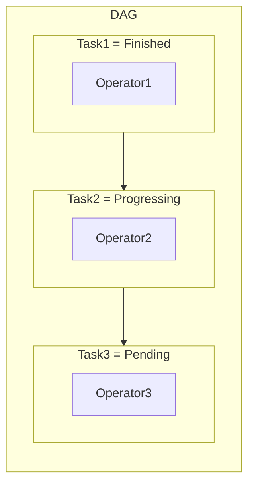

# Chapter 2

Code accompanying Chapter 2 of the book [Data Pipelines with Apache Airflow](https://www.manning.com/books/data-pipelines-with-apache-airflow).

## Contents

This folder contains DAGs from Chapter 2. 
The filenames and DAG ids follow the listing ids in the book. 
The final DAG is given in `listing_2_10.py`.

## Usage

To get started with the code examples, start Airflow with Docker Compose with the following command:

```bash
docker-compose up -d
```

The webserver initializes a few things, 
so wait for a few seconds, 
and you should be able to access the

Airflow webserver at http://localhost:8080.

To stop running the examples, 
run the following command:

```bash
docker-compose down -v
```

# Data Flow


# Anatomy of a DAG

Airflow uses DAGs and operators
Tasks are internal components to manage and display the state of an operator (e.g., started/finished)

