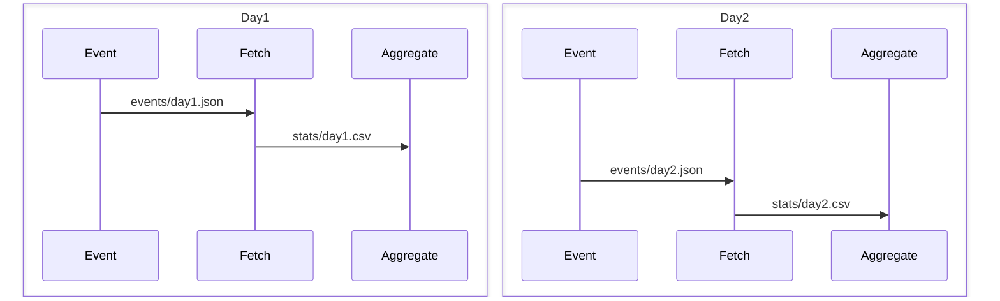

# Chapter 3

Code accompanying Chapter 3 of the book 'Data pipelines with Apache Airflow'.



## Contents

This code example contains the following DAGs:

- 01_unscheduled.py - Initial DAG without schedule.
- 02_daily_schedule.py - Same DAG following a daily schedule.
- 03_different_start_date.py - DAG with adjusted start date.
- 04_with_end_date.py - Modified DAG with an end date.
- 05_time_delta_schedule.py - DAG that uses a timedelta for the schedule interval.
- 06_query_with_dates.py - DAG including hard-coded dates in the query.
- 07_templated_query.py - Replaces hard-coded dates with templated execution dates.
- 08_templated_query_ds.py - Uses shorthands for the templated execution dates.
- 09_templated_path.py - Uses templating for the file paths as well.
- 10_full_example.py - Filly completed example, including 'sending' of statistics.

## Usage

To get started with the code examples, 

start Airflow in docker.

```
docker-compose up --build
```

Wait for a few seconds, then access the examples at http://localhost:8080/login.

When done, stop running airflow

```
docker-compose down -v
```


# Incremental Processing

## Interval-Based Scheduling

In interval-based scheduling, time is divided into discrete time intervals. Tasks are scheduled to run for each interval as soon as the corresponding interval has passed. Each task is provided with precise information regarding the start and end times of the interval it operates on.

## Time Point–Based Scheduling

Time point–based scheduling, such as cron jobs, involves executing tasks at specific times. Unlike interval-based scheduling, it's left to the task itself to determine the incremental interval it belongs to. Each task must determine the relevant interval it's operating within based on the execution time.


## Summary

- **Scheduled Interval:** DAGs can run at regular intervals by configuring the schedule interval.
  
- **Work Timing:** The work for each interval begins at the end of that interval.
  
- **Interval Configuration:** Schedule intervals can be set using cron or timedelta expressions for flexibility.
  
- **Incremental Processing:** Data can be processed incrementally by dynamically setting variables using templating.
  
- **Execution Date:** The execution date refers to the start datetime of the interval, not to the actual time of execution.
  
- **Backfilling:** DAGs can be retroactively executed for previous time periods using backfilling.
  
- **Idempotency:** Tasks are designed to be rerun without affecting the output results, ensuring consistency and reliability.
