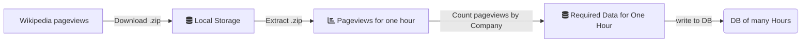

# Chapter 4

Code accompanying Chapter 4 of the book [Data Pipelines with Apache Airflow](https://www.manning.com/books/data-pipelines-with-apache-airflow).



## Contents

This folder contains DAGs from Chapter 4. The filenames and DAG ids follow the listing ids in the book. Near
the end of the chapter, we demonstrate usage of the PostgresOperator. The Docker Compose example in this
folder creates a second Postgres database so you don't have to setup things yourself when running the example.
If you like, you can access it:

- Host: `localhost`
- Port: `5433`
- Username: `airflow`
- Password: `airflow`
- Database: `airflow`

This database is initialized with the `pageview_counts` table as shown in the book.


## Usage

To get started with the code examples, start Airflow with Docker Compose with the following command:

```bash
docker-compose up -d
```

The webserver initializes a few things, so wait for a few seconds, and you should be able to access the
Airflow webserver at http://localhost:8080.

To stop running the examples, run the following command:

```bash
docker-compose down -v
```


# Context Variables

```
| Key               | Description                                                         | Example                 |
|-------------------|---------------------------------------------------------------------|-------------------------|
| conf              | Provides access to Airflow configuration                           | airflow.configuration.AirflowConfigParser object |
| dag               | The current DAG object                                             | dag_run                 |
| ds                | Execution date formatted as %Y-%m-%d                               | "2019-01-01"            |
| ds_nodash         | Execution date formatted as %Y%m%d                                 | "20190101"              |
| execution_date    | The start datetime of the task’s interval                          | pendulum.datetime.DateTime object |
| inlets            | Shorthand for task.inlets, a feature to track input data sources for data lineage | []                |
| macros            | airflow.macros module                                              | macros module           |
| next_ds           | Execution date of the next interval (= end of current interval) formatted as %Y-%m-%d | "2019-01-02" |
| next_ds_nodash    | Execution date of the next interval (= end of current interval) formatted as %Y%m%d | "20190102"   |
| next_execution_date | The start datetime of the task’s next interval (= end of current interval) | pendulum.datetime.DateTime object |
| outlets           | Shorthand for task.outlets, a feature to track output data sources for data lineage | []                |
| params            | User-provided variables to the task                                 | context{}               |
| prev_ds           | Execution date of the previous interval formatted as %Y-%m-%d       | "2018-12-31"            |
| prev_ds_nodash    | Execution date of the previous interval formatted as %Y%m%d         | "20181231"              |
| prev_execution_date | The start datetime of the task’s previous interval                  | pendulum.datetime.DateTime object |
| prev_execution_date_success | Start datetime of the last successfully completed run of the same task (only in past) | pendulum.datetime.DateTime object |
| prev_start_date_success | Date and time on which the last successful run of the same task (only in past) was started | pendulum.datetime.DateTime object |

```
